# Hardware-Accelerated Graphics Container on WSL

## 📖 Overview

This repository provides a Docker configuration to run hardware-accelerated 3D Linux applications on Windows Subsystem for Linux (WSL2).

Unlike legacy methods that rely on X11 forwarding or software rendering (llvmpipe), this setup utilizes the **Mesa D3D12** driver. This driver translates OpenGL API calls inside the container into DirectX 12 commands, which are executed by the Windows host GPU kernel.

### Key Features

  * 🚀 **Latest OpenGL 4.6 Support**: Uses the **Kisak Mesa PPA** to provide the newest stable Mesa drivers, ensuring full OpenGL 4.6 compliance (often ahead of default Ubuntu repos).
  * 🖥️ **GUI Support** via WSLg (Native Wayland & X11).
  * 🧩 **Headless EGL Support** for off-screen rendering.
  * 🔧 **Configurable Base Image** (Ubuntu 22.04 / 24.04) and adapter (NVIDIA, ...)
  * ⚡ **Near-Native Performance:** Direct communication with the host GPU via `/dev/dxg`.

## 🏗️ Rendering Workflow

On WSL, the container must relies on a "translation layer" approach. It does not access the GPU directly via PCI passthrough. Instead, it uses the Windows GPU Paravirtualization framework.

```mermaid
graph TD
    %% --- STYLING ---
    classDef container fill:#e1f5fe,stroke:#01579b,stroke-width:2px,color:black;
    classDef interface fill:#fff9c4,stroke:#fbc02d,stroke-width:2px,stroke-dasharray: 5 5,color:black;
    classDef host fill:#e8f5e9,stroke:#2e7d32,stroke-width:2px,color:black;
    classDef hardware fill:#424242,stroke:#000,stroke-width:2px,color:white;

    %% --- DOCKER CONTAINER LAYER ---
    subgraph Docker_Container [Docker Container Environment]
        direction TB
        App["<b>User Application</b><br/>(OpenGL 4.6 Call)"]:::container
        
        subgraph Software_Stack [Software Stack]
            EnvVars["<b>Env Vars</b><br/>GALLIUM_DRIVER=d3d12<br/>LD_LIBRARY_PATH=.../wsl/lib"]:::container
            Mesa["<b>Mesa 3D / Gallium</b><br/>(Translator)"]:::container
        end
    end

    %% --- INTERFACE LAYER (VOLUMES & DEVICES) ---
    subgraph Docker_Interface [Docker Volume & Device Maps]
        LibMount["<b>/usr/lib/wsl</b><br/>(Mounts Windows Drivers)"]:::interface
        DevDXG["<b>/dev/dxg</b><br/>(DirectX Device Node)"]:::interface
        SocketMount["<b>/mnt/wslg & /tmp/.X11-unix</b><br/>(Wayland/X11 Sockets)"]:::interface
    end

    %% --- WINDOWS HOST LAYER ---
    subgraph Windows_Host [Windows Host / WSL2]
        DXKernel["<b>DirectX Kernel</b><br/>(WDDM)"]:::host
        WSLg["<b>WSLg System</b><br/>(Compositor)"]:::host
        NVDriver["<b>NVIDIA Driver</b><br/>(Windows Host Side)"]:::host
    end

    %% --- HARDWARE LAYER ---
    subgraph Hardware
        GPU["<b>NVIDIA GPU</b><br/>(Hardware Acceleration)"]:::hardware
        Screen["<b>Physical Monitor</b>"]:::hardware
    end

    %% --- CONNECTIONS: RENDERING FLOW ---
    App -- "1. Sends OpenGL Command" --> Mesa
    EnvVars -. "Configures" .-> Mesa
    LibMount -. "Injects d3d12.so shim" .-> Mesa
    Mesa -- "2. Translates to D3D12" --> DevDXG
    DevDXG -- "3. Passes to Host Kernel" --> DXKernel
    DXKernel --> NVDriver
    NVDriver -- "4. Executes Calculation" --> GPU

    %% --- CONNECTIONS: DISPLAY FLOW ---
    App -- "5. Sends Window/Frame Data" --> SocketMount
    SocketMount -- "6. Transmits to Host" --> WSLg
    WSLg -- "7. Draws Window" --> Screen

    %% --- LINK STYLES ---
    linkStyle 0,3,4,5,6 stroke-width:2px,fill:none,stroke:blue;
    linkStyle 7,8,9 stroke-width:2px,fill:none,stroke:red;
```



**🧠 How it works**:

1.  **Rendering (The Blue Path):** When an app draws 3D geometry, Mesa uses the `d3d12` driver to convert those instructions into DirectX 12. These are sent through `/dev/dxg` to the Windows NVIDIA driver.
2.  **Displaying (The Red Path):** When an app wants to show a window, it connects to the Wayland/X11 sockets mounted at `/mnt/wslg`, allowing the window to appear seamlessly on the Windows desktop.

## ⚙️ Prerequisites

1.  **Windows 10 or 11** with WSL2 enabled.
2.  **NVIDIA Drivers** installed on Windows (Host side). *You do not need drivers inside WSL.*
3.  **Docker Desktop** configured to use the **WSL 2 backend**.

## 🚀 Usage

### 1. 📥 Clone the Repository

```bash
git clone https://github.com/MatLN8/wsl-gpu-graphics-container.git
cd wsl-gpu-graphics-container
```

*Modify the `Dockerfile` to your need*

### 2. 🏗️ Build the Image

```bash
docker build -t wsl-gl-image .
```

### 3. 🚀 Run the Container

```bash
docker run -it --rm \
  --gpus all \
  --device /dev/dxg \
  -v /usr/lib/wsl:/usr/lib/wsl:ro \
  -v /mnt/wslg:/mnt/wslg \
  -v /tmp/.X11-unix:/tmp/.X11-unix \
  -e DISPLAY=$DISPLAY \
  -e WAYLAND_DISPLAY=$WAYLAND_DISPLAY \
  -e XDG_RUNTIME_DIR=$XDG_RUNTIME_DIR \
  wsl-gl-image <CMD>
```

**🔍 Command Breakdown**:

| Category | Flag | Purpose |
| :--- | :--- | :--- |
| **GPU Options** | `--gpus all` | Enables the NVIDIA Container Toolkit to pass GPU capabilities (CUDA, etc). |
| **Devices** | `--device /dev/dxg` | Passes the DirectX Graphics Kernel device to the container (Essential for D3D12). |
| **Volumes** | `-v /usr/lib/wsl...` | **Critical:** Mounts the Windows host drivers (`libd3d12.so`) so Linux can use them. |
| **Volumes** | `-v /mnt/wslg...` | Mounts the Wayland and PulseAudio sockets for GUI and Sound. |
| **Volumes** | `-v /tmp/.X11-unix` | Mounts the X11 socket (fallback for non-Wayland apps). |
| **Environment** | `-e DISPLAY` | Tells X11 apps where to send the window. |
| **Environment** | `-e WAYLAND...` | Tells Wayland apps which socket to use. |

## 🛠️ Configuration

### Why the Kisak PPA?

The `Dockerfile` adds the `ppa:kisak/turtle` repository.
We use this instead of the default Ubuntu repositories because the `d3d12` Gallium driver is rapidly evolving. The default repositories often contain older versions of Mesa that lack the latest DirectX 12 translation improvements or full OpenGL 4.6 support. Kisak ensures we are always on the latest stable release.

### Build Arguments

You can customize the build by overriding `ARG` values in the `docker-compose.yml` or CLI.

| Argument | Default | Description |
| :--- | :--- | :--- |
| `BASE_IMAGE` | `ubuntu:22.04` | The OS version. Supports `ubuntu:22.04` or `ubuntu:24.04`. |
| `ADAPTER` | `NVIDIA` | Sets the preferred GPU vendor string. |

**Example: Changing Base Image**

```yaml
# docker-compose.yml
services:
  devcontainer:
    build:
      context: .
      args:
        - BASE_IMAGE=ubuntu:24.04
```

### Docker Compose Reference

The `docker-compose.yml` must contain these critical mappings:

```yaml
services:
  devcontainer:
    build: .
    environment:
      - DISPLAY=${DISPLAY}
      - WAYLAND_DISPLAY=${WAYLAND_DISPLAY}
      - XDG_RUNTIME_DIR=${XDG_RUNTIME_DIR}
    volumes:
      - /tmp/.X11-unix:/tmp/.X11-unix   # Legacy X11
      - /mnt/wslg:/mnt/wslg             # WSLg (Wayland)
      - /usr/lib/wsl:/usr/lib/wsl:ro    # Host Drivers
    devices:
      - /dev/dxg                        # DirectX Interface
    deploy:
      resources:
        reservations:
          devices:
            - driver: nvidia
              count: 1
              capabilities: [gpu]
```

## 🔍 Checks

### Verify Hardware Acceleration

```bash
docker run -it --rm \
  --gpus all \
  --device /dev/dxg \
  -v /usr/lib/wsl:/usr/lib/wsl:ro \
  -v /mnt/wslg:/mnt/wslg \
  -v /tmp/.X11-unix:/tmp/.X11-unix \
  -e DISPLAY=$DISPLAY \
  -e WAYLAND_DISPLAY=$WAYLAND_DISPLAY \
  -e XDG_RUNTIME_DIR=$XDG_RUNTIME_DIR \
  wsl-gl-image glxinfo -B
```

**Expected Output:**

  * `Device`: Should say **D3D12 (NVIDIA ...)**. *If it says "llvmpipe", acceleration is NOT working.*
  * `OpenGL version`: Should be **4.6**.

### Test GUI

```bash
docker run -it --rm \
  --gpus all \
  --device /dev/dxg \
  -v /usr/lib/wsl:/usr/lib/wsl:ro \
  -v /mnt/wslg:/mnt/wslg \
  -v /tmp/.X11-unix:/tmp/.X11-unix \
  -e DISPLAY=$DISPLAY \
  -e WAYLAND_DISPLAY=$WAYLAND_DISPLAY \
  -e XDG_RUNTIME_DIR=$XDG_RUNTIME_DIR \
  wsl-gl-image glxgears
```

*You should see the classic gears animation running smoothly.*

## ❓ Troubleshooting

**Error: `/dev/dxg` not found**
  * Ensure you are running this from a WSL2 terminal, not PowerShell.
  * Ensure the WSL kernel is up to date (`wsl --update`).

**Error: `glxinfo` shows `llvmpipe`**
  * Check that `/usr/lib/wsl` is mounted correctly.
  * Ensure `LD_LIBRARY_PATH` includes `/usr/lib/wsl/lib`.

**GUI windows do not appear**
  * Ensure `DISPLAY` and `WAYLAND_DISPLAY` environment variables are passed to the container.
  * Restart WSL (`wsl --shutdown`) and Docker Desktop.